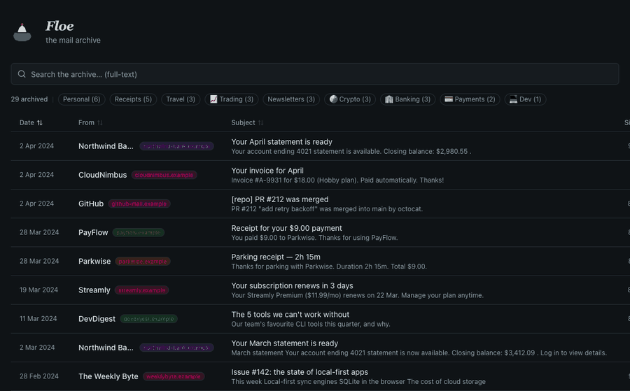

# Floe — your cold-storage email archive

> *Cold storage, warm UI.*



A searchable browser for email archives stored in any S3-compatible bucket. Pairs with [`gmail-cold-storage`](https://github.com/camposcristian/gmail-cold-storage) (the archiver).

### Why "Floe"?

An [ice floe](https://en.wikipedia.org/wiki/Ice_floe) is a sheet of floating sea ice — visible on the surface, but most of the mass is below. Your inbox works the same way: Gmail shows you the tip, but years of receipts, conversations, and attachments sit frozen underneath. Floe surfaces all of it from cold storage so you can search and read without thawing your wallet.

 

---

## Why this exists

Gmail storage fills up. Fifteen years of receipts, newsletters, CI notifications, screenshotted conversations, PDFs from banks. None of it useful day-to-day, but you can't quite bring yourself to delete it because every so often you need to look something up from 2016.

Google's answer is **Google One at $10–15/month** (AUD), which for me meant **$120–180/year**, forever, to hold data I touch maybe 20 times a year.

The cheaper answer is: move all that old stuff to **object storage** (Cloudflare R2, S3-compatible, **$0.015/GB-month** and **free egress**). The [`gmail-cold-storage`](https://github.com/camposcristian/gmail-cold-storage) repo does the archive side — pulls raw `.eml` from Gmail, uploads to R2, maintains an index, then lets you delete from Gmail once the archive is verified.

But raw `.eml` files in a bucket are useless without a way to read them. That's **Floe** — the viewer.

40 GB of email in R2 costs me about **$7/year**. No Google One. Same data, same searchability, better UI.

---

## Quick deploy

[](https://deploy.workers.cloudflare.com/?url=https://github.com/camposcristian/email-archive)

After deploy, bind your R2 bucket:
1. Go to **Cloudflare Dashboard → Pages → email-archive → Settings → Functions**
2. Add R2 binding: Variable name `COLD_STORAGE`, bucket `cold-storage`
3. (Optional) Add **Cloudflare Access** policy to restrict who can view the archive

---

## What it does

- 📇 **Index listing** — all archived emails in one sortable, paginated table (date / from / subject / size), with deterministic color pills per sender domain
- 🔎 **Instant client-side search** — SQLite queries via sql.js (WASM), searches across subject, from, to, and snippet
- 📊 **Sender-domain stats bar** — top domains as clickable filters
- 📄 **Full email reader** — opens a dialog with parsed HTML body, inline CID images resolved, text fallback, attachment list
- 📎 **Per-attachment download** — click to download any individual attachment out of a `.eml` without fetching the whole file
- 📥 **Raw `.eml` download** — if you want the original message-as-sent
- 🌓 **Dark mode** — polar night with a signal-flare accent, follows `prefers-color-scheme`
- 🔒 **Self-hosted, gated** — runs as a private Cloudflare Pages project behind Cloudflare Access (GitHub login with passkey, in my case)

---

## How it works

```
┌──────────────────┐   GET /api/db           ┌───────────────────┐
│                  │ ────────────────────▶   │                   │
│   React + Vite   │   GET /api/email/{key}  │  Pages Functions  │
│   + sql.js WASM  │ ────────────────────▶   │   (functions/)    │
│                  │                          │                   │
└──────────────────┘                          └─────────┬─────────┘
     ▲ queries SQLite                                   │
     │ in-browser                                       │ reads .eml + index.db
     └─── index.db ◄────                               ▼
          (loaded once,                       ┌───────────────────┐
           ~4 MB for 3.6k emails)             │  S3-compatible    │
                                              │  bucket (R2, etc) │
                                              └───────────────────┘
```

The frontend is a static Vite + React + Tailwind SPA. The email index is a **portable SQLite database** (`index.db`) loaded into the browser via [sql.js](https://github.com/sql-js/sql.js) (WASM) — all search and pagination happens client-side with zero API round-trips. Three Pages Functions provide the backend:

- `GET /api/db` → serves `emails/gmail/index.db` from R2 (SQLite with FTS5 metadata index)
- `GET /api/email/{r2Key}` → fetches the raw `.eml` from R2, parses it server-side with [`postal-mime`](https://github.com/postalsys/postal-mime), inlines CID images as data URIs, returns a JSON payload with HTML + text + attachment metadata
- `GET /api/email/{r2Key}?raw=1` → original `.eml` for download
- `GET /api/email/{r2Key}?attachment=N` → individual attachment

R2 is bound to the Functions via `wrangler.toml` (`COLD_STORAGE`). No secrets in the code, no S3 SDK — just the Pages runtime talking to R2 directly. The SQLite file is portable — swap R2 for any S3-compatible provider and it still works.

### Why server-side parsing

Parsing `.eml` in the browser is possible but `.eml`s with embedded images and deep MIME trees blow up bundle size and CPU. Parsing in the Function keeps the client bundle under 70 KB gzipped and lets you inline CID images as base64 data URIs so the rendered HTML works without any secondary fetch.

---

## Project layout

```
email-archive/
├── functions/api/              Cloudflare Pages Functions
│   ├── db.ts                   GET /api/db       → index.db (SQLite)
│   ├── index.ts                GET /api          → index.json (legacy)
│   └── email/[[path]].ts      GET /api/email/*  → parsed .eml / raw / attachment
├── src/
│   ├── App.tsx                 Top-level UI
│   ├── components/
│   │   ├── email-list.tsx      Sortable table with domain-hue pills
│   │   ├── email-detail.tsx    Modal reader (HTML body + attachments)
│   │   ├── pagination.tsx      Page navigation
│   │   ├── search-bar.tsx      Debounced full-text search
│   │   ├── stats-bar.tsx       Sender-domain quick filters
│   │   └── floe-mark.tsx       Iceberg brand mark (SVG)
│   ├── lib/
│   │   ├── email-db.ts         Client-side SQLite queries (sql.js WASM)
│   │   └── utils.ts            formatDate, extractName, extractDomain, ...
│   ├── types/email.ts          EmailEntry interface
│   └── index.css               Tailwind + Floe design tokens
├── public/
│   ├── sql-wasm-browser.wasm   sql.js WASM binary (served locally)
│   ├── favicon.svg             Iceberg mark
│   └── wordmark.svg            "Floe" in Fraunces italic 700
├── local-server.mjs            Local dev server (bypasses wrangler account woes)
├── scripts/cf-pages-deploy.mjs Direct Pages API deploy (fallback)
├── wrangler.toml               R2 binding (COLD_STORAGE → cold-storage)
└── .github/workflows/deploy.yml  Auto-deploy on push to main
```

---

## Running it

### Prerequisites

- Node 20+
- An S3-compatible bucket containing an email archive in the shape [`gmail-cold-storage`](https://github.com/camposcristian/gmail-cold-storage) produces (`emails/gmail/index.db` + `emails/gmail/YYYY/MM/*.eml`)
- `wrangler login` done, with the bucket's account as the active one

### Local dev (against the real R2 bucket)

```bash
npm install
npm run build
npm run local
```

Opens at **http://localhost:8788**. Uses `local-server.mjs` — a small Node server that mirrors the Pages Functions API but fetches from remote R2 via the `wrangler r2 object get` CLI. On-disk cache at `.local-cache/` makes repeat opens instant.

Why not `wrangler pages dev`? It binds to local-only miniflare R2 (empty). `wrangler pages dev --remote` doesn't exist in wrangler 4.x. The shell-out approach was the pragmatic fix — see the commit log for the full story if curious.

### Deploy (Cloudflare Pages)

Either push to `main` (GitHub Action will run `wrangler pages deploy`), or manually:

```bash
CLOUDFLARE_ACCOUNT_ID=<your_account_id> \
  npx wrangler pages deploy dist --project-name=email-archive --commit-dirty=true
```

**Gotcha:** if you use wrangler with an OAuth session that has multiple accounts, there's a cache at `node_modules/.cache/wrangler/pages.json` that pins the account ID per project. Delete it or overwrite the `account_id` field to switch accounts. See [commit d453e51](#) for the investigation — the short version: `getAccountId()` short-circuits on `config.account_id` before ever checking `CLOUDFLARE_ACCOUNT_ID`, so the env var is silently ignored for `pages deploy`.

### Locking it down

`email-archive.pages.dev` is open by default. To restrict:

1. **Cloudflare Zero Trust → Access → Applications → Add self-hosted**
2. Destination: subdomain `email-archive`, domain `pages.dev` (+ optionally `*.email-archive.pages.dev` for preview deploys)
3. Identity provider: GitHub OAuth App (create one, paste callback URL `https://<team>.cloudflareaccess.com/cdn-cgi/access/callback`)
4. Policy: `Allow` + `Emails = <your github email>`
5. Turn OFF "Authenticate via Cloudflare One Client" (the WARP toggle — causes a session-duration error)

With that, the viewer redirects unauth'd traffic to GitHub, which logs you in with a passkey and drops you back into the app. ~1 click for your own archive, locked to everyone else.

---

## Design

The **Floe** identity (iceberg mark, Fraunces italic wordmark, polar-night palette with signal-flare accent) was designed around the cold-storage metaphor. The design tokens live in `src/index.css` under `@theme`; body stays on system sans, the wordmark uses `Fraunces` via the `.font-display` utility.

An ice floe is the visible surface of something massive floating beneath. Gmail shows you the tip; Floe lets you see all of it.

---

## Costs (approximate, AUD)

| Component | Tier | Cost |
|---|---|---|
| R2 storage (40 GB) | $0.015/GB/mo | ~$0.60/mo |
| R2 Class B ops (reads) | $0.36/M | <$0.01/mo |
| Pages | Free tier | $0 |
| Cloudflare Access | Free tier (up to 50 users) | $0 |
| **Total** | | **~$7/year** |

vs. Google One 2 TB = **$180/year**.

---

## Related

- [camposcristian/gmail-cold-storage](https://github.com/camposcristian/gmail-cold-storage) — the archiver. Public. Has the full methodology doc, cost tables, and cleanup strategies for finding big attachments in Gmail.

---

## License

MIT. If you build your own archive + viewer combo from this, I'd love to hear about it.
